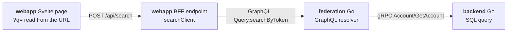

# panopticode

**Compositional taint analysis across repositories and services, over a language-neutral code graph.**

[](https://github.com/panoptiorg/panopticode/actions/workflows/ci.yml)
[](LICENSE)

Yet another security scanner? Yes, but actually no...

The first thing you probably think of is taint analysis: mark the data that
comes from an untrusted source and follow it to the dangerous operations it
reaches. That works well, but most taint analysers stop at the repository
boundary. So what?
A modern large-scale environment is hundreds of services, each with
its own role, talking to each other over the network. A great example is the
backend-for-frontend (BFF) architecture: a frontend (a web app, a mobile app or
whatever) prepares some data, a BFF service applies its own logic to it, and
the data finally travels on to the backend services. How can we answer: "Can
the search term a user puts in the page's `?q=` parameter reach a SQL query in
one of hundreds of services?" Known open-source tools cannot answer this
question. In the BFF, the value arrives as the `token` of a request and leaves
in a GraphQL query. In the backend, it simply appears as the `Number` field of
a gRPC request. Each scanner sees one piece of the path, and the trail goes
cold at every network hop, losing the context of a threat that travels through
several services.

To solve that, panopticode can analyse all the repositories together. It
matches each network call (gRPC or GraphQL today) to its handler in the other
repository by contract name and treats it as an ordinary function call. A
value's path from a web page, through a BFF, a GraphQL gateway and a gRPC call,
to a SQL query two services away comes out as one finding with one route:



This repository is the **engine**. It never reads source code. Per-language
[frontends](#frontends) extract each repository into CGF (*code graph facts*),
and the engine joins any number of them into one program.

**More details, with visual explanations: [panopti.org](https://panopti.org)**

## Quickstart

You need Rust and `protoc`. The repository ships pre-extracted CGF for the
three repositories presented in [docs/example](docs/example.md), so you can try the engine without running a frontend:

```bash
cargo build --manifest-path core/Cargo.toml
./core/target/debug/panopticode taint --catalog catalog.example.toml \
    --cgf testdata/cgf/webapp --cgf testdata/cgf/federation --cgf testdata/cgf/backend \
    > chains.json 2> taint.log
```

`chains.json` now holds 15 findings. This is the route of the one pictured above:

```console
$ jq -r '.[] | select(.sink_class == "sqli" and (.source_fn | endswith("+page.svelte:$script")))
    | .route.hops[] | [.kind, .repo, .callee // .func] | @tsv' chains.json | column -t
source    webapp                  src/routes/search/+page.svelte:$script
call      webapp                  URLSearchParams.get
call      webapp                  src/service/gateway/endpoints/search/index.ts:searchClient
call      webapp                  src/service/gateway/endpoints/search/index.ts:$op
boundary  webapp                  graphql:Query.searchByToken
boundary  example.com/federation  pb.Account/GetAccount
call      example.com/backend     (*example.com/backend/store.Storage).FindAccountByNumber
call      example.com/backend     (*example.com/backend/store.Storage).findBy
sink      example.com/backend     (*example.com/backend/store.Storage).Selectx
```

`taint.log` lists what the run could not see, such as catalog rules that matched
nothing and calls with no body. [Check it on every run](docs/cli.md#taint).

## Frontends

| language | repository | boundaries it recognises |
|---|---|---|
| Go | [panoptife-go](https://github.com/panoptiorg/panoptife-go) | gRPC (`protoc-gen-go-grpc`), GraphQL (`gqlgen`) |
| TypeScript, Svelte | [panoptife-ts](https://github.com/panoptiorg/panoptife-ts) | SvelteKit routes, GraphQL clients |
| Python | [panoptife-py](https://github.com/panoptiorg/panoptife-py) | planned |

Supporting a new language takes a new frontend and no engine changes. The
format a frontend writes is described in [docs/cgf.md](docs/cgf.md).

## Documentation

| | |
|---|---|
| [CLI](docs/cli.md) | every command, flag and exit code; Docker; optional Postgres |
| [Catalog](docs/catalog.md) | how to write sources, sinks, sanitizers and propagators |
| [Architecture](docs/architecture.md) | how the engine works |
| [CGF](docs/cgf.md) | the input format, for frontend authors |
| [Limitations](docs/limitations.md) | what it misses, and why |
| [Example system](docs/example.md) | the system pictured above, mapped to its code and its 18 findings |
| [testdata/cgf](testdata/cgf/README.md) | the fixture corpus used above |


## Contributions
Are greatly welcome; see [CONTRIBUTING.md](CONTRIBUTING.md). Licensed under
[Apache-2.0](LICENSE).
