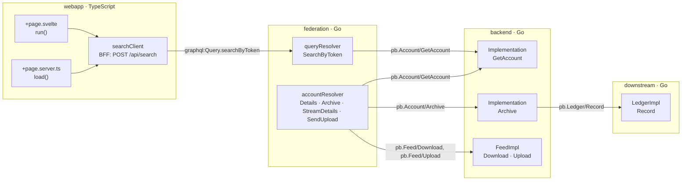

# The example system

The golden CGF in [`testdata/cgf/`](../testdata/cgf/README.md) includes a small
made-up system of four repositories in two languages: a SvelteKit web app with a
backend-for-frontend (BFF), a GraphQL gateway, and two gRPC services. The README,
the [CLI reference](cli.md) and the end-to-end tests quote findings from it.
This page maps that system to its source code and to the 18 findings the engine
reports when it loads all four repositories.

| repository | language | role | source | golden CGF |
|---|---|---|---|---|
| `webapp` | TypeScript, SvelteKit | a search page, and a BFF endpoint that sends GraphQL | [panoptife-ts `fixtures/webapp`][webapp] | `testdata/cgf/webapp` |
| `example.com/federation` | Go, gqlgen | the GraphQL gateway; its resolvers call gRPC | [panoptife-go `fixtures/federation`][federation] | `testdata/cgf/federation` |
| `example.com/backend` | Go, gRPC | the `Account` and `Feed` services, with SQL | [panoptife-go `fixtures/backend`][backend] | `testdata/cgf/backend` |
| `example.com/downstream` | Go, gRPC | the `Ledger` service, with SQL | [panoptife-go `fixtures/downstream`][downstream] | `testdata/cgf/downstream` |

The fixtures are as small as the shapes they exercise. The `pb` packages are
hand-written stand-ins for `protoc-gen-go-grpc` output, `federation/graph/generated`
mimics gqlgen's generated root, and `Storage.Selectx` stands in for a SQL
wrapper: it builds a string and executes nothing.

## Architecture



The page and the server `load` call the BFF endpoint `searchClient` inside the
same repository, so that hop is an ordinary call. Every arrow between
repositories is a contract.

## Contracts

A contract is the name both sides of a remote call derive independently. The
engine joins them by that name alone.

| contract | kind | client: who calls it | server: who handles it |
|---|---|---|---|
| `graphql:Query.searchByToken` | GraphQL query | webapp, `src/service/gateway/endpoints/search/index.ts`: the `Search` operation, sent by `searchClient` | federation, `graph/graph.go`: `(*queryResolver).SearchByToken`, reached through the gqlgen dispatcher `_Query_searchByToken` in `graph/generated` |
| `pb.Account/GetAccount` | gRPC unary | federation, `graph/graph.go`: `Details`, `fetchDetails` (called by `DetailsViaHelper`) and `SearchByToken`; `provider/provider.go`: `(*Provider).Lookup` | backend, `app/app.go`: `(*Implementation).GetAccount` |
| `pb.Account/Archive` | gRPC unary | federation: `(*accountResolver).Archive` | backend: `(*Implementation).Archive` |
| `pb.Ledger/Record` | gRPC unary | backend: `(*Implementation).Archive` | downstream, `app/app.go`: `(*LedgerImpl).Record` |
| `pb.Feed/Download` | gRPC server stream | federation: `(*accountResolver).StreamDetails` | backend, `app/feed.go`: `(*FeedImpl).Download` |
| `pb.Feed/Upload` | gRPC client stream | federation: `(*accountResolver).SendUpload` | backend: `(*FeedImpl).Upload` |

How each side finds its name:

- **gRPC.** The name is `<Go package of the generated code>.<Service>/<Method>`.
  A client is a call on a generated `<Service>Client` in a `pb` package. A
  server is a struct that embeds `UnimplementedAccountServer` or
  `UnimplementedLedgerServer`, or, for `FeedImpl`, `UnsafeFeedServer`.
  `provider.Client` is a hand-written interface over `pb.AccountClient`; the
  Go frontend still finds the boundary because exactly one generated client
  implements it.
- **GraphQL.** The webapp names the operation's field with its parent type
  from its `schema.graphql` snapshot. The federation names its resolver from
  the gqlgen root, which `ResolverRoot`, `DirectiveRoot` and `ComplexityRoot`
  identify. Both arrive at `graphql:Query.searchByToken`.

## Where untrusted data enters

| repository | entry point | code | why it is a source |
|---|---|---|---|
| webapp | the search page | `+page.svelte`, `run()`: `$page.url.searchParams.get('q')` | catalog source `ts_url_query` matches `URLSearchParams.get` |
| webapp | the server `load` | `+page.server.ts`: `load({ url })`, then `url.searchParams.get('token')` | a server `load` is an HTTP endpoint (`load src/routes/search`), so its parameter is untrusted |
| webapp | the BFF endpoint | `index.ts`: `searchClient` | the `bff-gateway` adapter makes each gateway handler a route, `POST /api/search`, whose variables are untrusted |
| federation | a GraphQL argument | `(*queryResolver).SearchByToken(ctx, token)` | the arguments of a gqlgen root resolver are untrusted; a field resolver's `obj` is not |
| federation | a GraphQL model field | `obj.GetAccountNumber()` in the `accountResolver` methods | catalog source `graphql_input`, a test-only rule for this getter |
| backend, downstream | a gRPC request | `GetAccount`, `Archive`, `Download`, `Record`: `req` | a gRPC handler's request is untrusted |
| backend | a client-stream message | `(*FeedImpl).Upload`: `s.Recv()` | the stream-in port of `pb.Feed/Upload` |

## Where it ends up

| sink | class | code | catalog rule |
|---|---|---|---|
| `(*store.Storage).Selectx` in backend | `sqli` | `store/store.go`: reached from `FindAccountByNumber` through `findBy`, a variadic call | `[[sinks]]` `\.(Getx\|Selectx\|Execx\|Queryx\|Getxx)$` |
| `(*store.Storage).Selectx` in downstream | `sqli` | `store/store.go`, called by `(*LedgerImpl).Record` | same |
| `(*store.Storage).Selectx` in federation | `sqli` | `store/store.go`, called by `(*accountResolver).StreamDetails` | same |
| `goto(q)` | `open_redirect` | `+page.svelte`, `run()` | `[[sinks]]` matching `navigation.goto` |
| `{@html res}` | `xss` | `+page.svelte`, the template | `[[sinks]]` matching `svelte:html` |

## The findings

```bash
panopticode taint --catalog catalog.example.toml \
    --cgf testdata/cgf/webapp --cgf testdata/cgf/federation \
    --cgf testdata/cgf/backend --cgf testdata/cgf/downstream > chains.json
```

This prints 18 findings. The README's quickstart leaves `downstream` out and
gets 15: the three findings that reach `LedgerImpl.Record` need it.

| starts at | crosses | ends at | what it shows |
|---|---|---|---|
| webapp `+page.svelte` (`?q=`) | `graphql:Query.searchByToken`, `pb.Account/GetAccount` | backend SQL | **The README's finding**: a browser input reaches SQL two services away. |
| webapp `+page.server.ts` `load` | the same two | backend SQL | The same path from the server `load`. |
| webapp `searchClient` (`POST /api/search`) | the same two | backend SQL | The same path from the BFF endpoint. |
| webapp `+page.svelte` | none | `goto(q)` | `open_redirect`, local to the page. |
| webapp `+page.svelte` | none | `{@html res}` | `xss`: the GraphQL result, derived from `q`, rendered as HTML. |
| federation `SearchByToken` | `pb.Account/GetAccount` | backend SQL | A bare GraphQL argument as a source. |
| federation `Details` | `pb.Account/GetAccount` | backend SQL | A call on the generated client. |
| federation `DetailsViaHelper` | `pb.Account/GetAccount` | backend SQL | The remote call sits in a local helper, `fetchDetails`. Found only after the cross-repository fixpoint. |
| federation `DetailsViaLocalClient` | `pb.Account/GetAccount` | backend SQL | The call goes through the hand-written `provider.Client` interface. |
| federation `Archive` | `pb.Account/Archive`, `pb.Ledger/Record` | downstream SQL | Two boundaries in a row: the backend handler has no sink of its own and forwards the value. |
| backend `Archive` | `pb.Ledger/Record` | downstream SQL | The middle hop of that chain on its own. |
| federation `StreamDetails` | `pb.Feed/Download` | backend SQL | Taint into a server-stream call. |
| federation `StreamDetails` | `pb.Feed/Download`, back to the client | federation SQL | The streamed response comes back through `Recv()` and reaches the federation's own SQL. |
| federation `SendUpload` | `pb.Feed/Upload` | backend SQL | Taint sent into a client stream with `Send`. |
| backend `Upload` | the stream-in port of `pb.Feed/Upload` | backend SQL | A client-stream message as a source. |
| backend `GetAccount` | none | backend SQL | The handler alone. |
| backend `Download` | none | backend SQL | The handler alone. |
| downstream `Record` | none | downstream SQL | The handler alone. |

Each handler is also an entry point in its own right, so a path through it can
appear twice: once from the caller in another repository and once from the
handler. That is expected; every finding has its own route.

## One finding, hop by hop

The README's finding, as `route.hops` lists it, next to the code each hop
comes from:

| hop | repository | name in the route | code |
|---|---|---|---|
| `source` | webapp | `+page.svelte:$script` | `const q = $page.url.searchParams.get('q') ?? '';` |
| `call` | webapp | `URLSearchParams.get` | the read above: the source call |
| `call` | webapp | `searchClient` | `res = await searchClient.call({ token: q });` |
| `call` | webapp | `$op`, the `Search` operation | `query Search($token: String!) { searchByToken(token: $token) }` |
| `boundary` | webapp → federation | `graphql:Query.searchByToken` | handled by `SearchByToken(ctx, token)` |
| `boundary` | federation → backend | `pb.Account/GetAccount` | `r.client.GetAccount(ctx, &pb.GetAccountRequest{Number: token})`, handled by `GetAccount(ctx, req)` |
| `call` | backend | `FindAccountByNumber` | `i.storage.FindAccountByNumber(req.GetNumber())` |
| `call` | backend | `findBy` | `s.findBy("number = ?", number)` |
| `sink` | backend | `Selectx` | `q := pred + args[0]`, then `s.Selectx(q)` |

The `searchClient` and `$op` hops are the page's call into the BFF and the
operation the BFF sends. The engine reads the page and the BFF endpoint from
the same repository, so it needs no contract for that hop.

## Rebuilding it

The golden CGF is extracted from the fixtures above by
`scripts/regen-testdata.sh`, which needs both frontends checked out next to
this repository. The exact commands, and the single-feature fixtures that live
next to these four, are in
[`testdata/cgf/README.md`](../testdata/cgf/README.md).

[webapp]: https://github.com/panoptiorg/panoptife-ts/tree/main/fixtures/webapp
[federation]: https://github.com/panoptiorg/panoptife-go/tree/main/fixtures/federation
[backend]: https://github.com/panoptiorg/panoptife-go/tree/main/fixtures/backend
[downstream]: https://github.com/panoptiorg/panoptife-go/tree/main/fixtures/downstream
